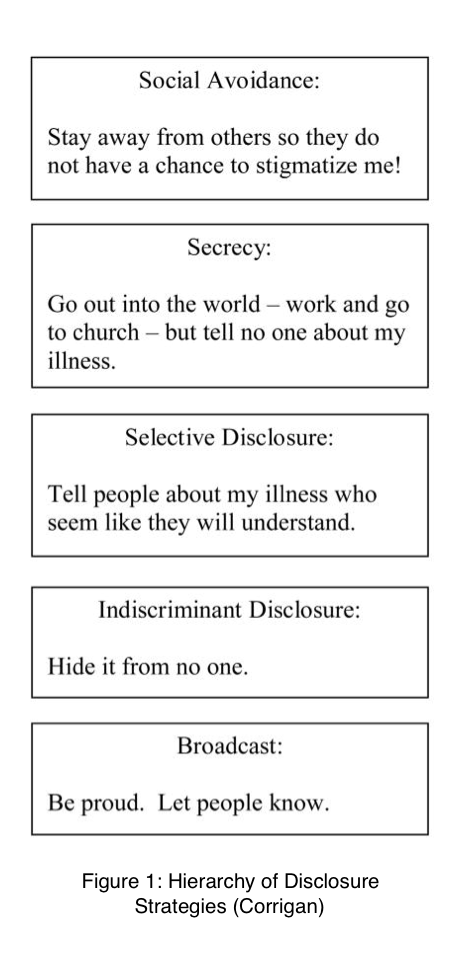

Typically, when we discuss the need for reducing stigma around mental health, we focus talk about the public stigma, or the discrimination that people with mental illnesses face from the general population. When student organizations, for example, raise awareness about mental health through events like study breaks, we can usually make at least some progress towards changing the public perception of mental health. However, self-stigma not only often goes unaddressed, but can also be much harder to combat. With self-stigma, people suffer additionally because they internalize the public’s negative perceptions of mental health. This contributes to the complexity of combatting stigma around mental illnesses. 

At my high school, public stigma was the primary issue when addressing mental health, so we couldn’t even consider how to reduce the effects of self-stigma – public stigma had to be reduced first. At Harvard, however, I believe that public stigma isn’t as bad, but self-stigma is something we can all try to improve. 

From my experience, I’ve noticed that students are completely happy to talk about mental health as a topic, but become much more cautious when the topic applies to themselves. More specifically, I think that some students may feel that though it’s not shameful at all for others to have mental illnesses, it is shameful for the students themselves to have mental illnesses.

While there are no easy answers to solving self-stigma, Corrigan (2012) has provided some insights into the potential solution of disclosure. Many people try to combat stigma by keeping their mental illnesses to themselves and hence avoiding shame. Corrigan, however, found that disclosure of mental illnesses is “associated with decreased negative effects of self-stigmatization on quality of life.” At the same time, however, openness can lead to discrimination by the public and in some cases “may be more isolating.” Furthermore, disclosure is a complicated topic as there are many different levels of disclosure that can lead to different effects in different contexts.

While the solutions are not immediately clear on how to reduce self-stigma, we must start by recognizing that the issue exists and that more research needs to be done on the area.

